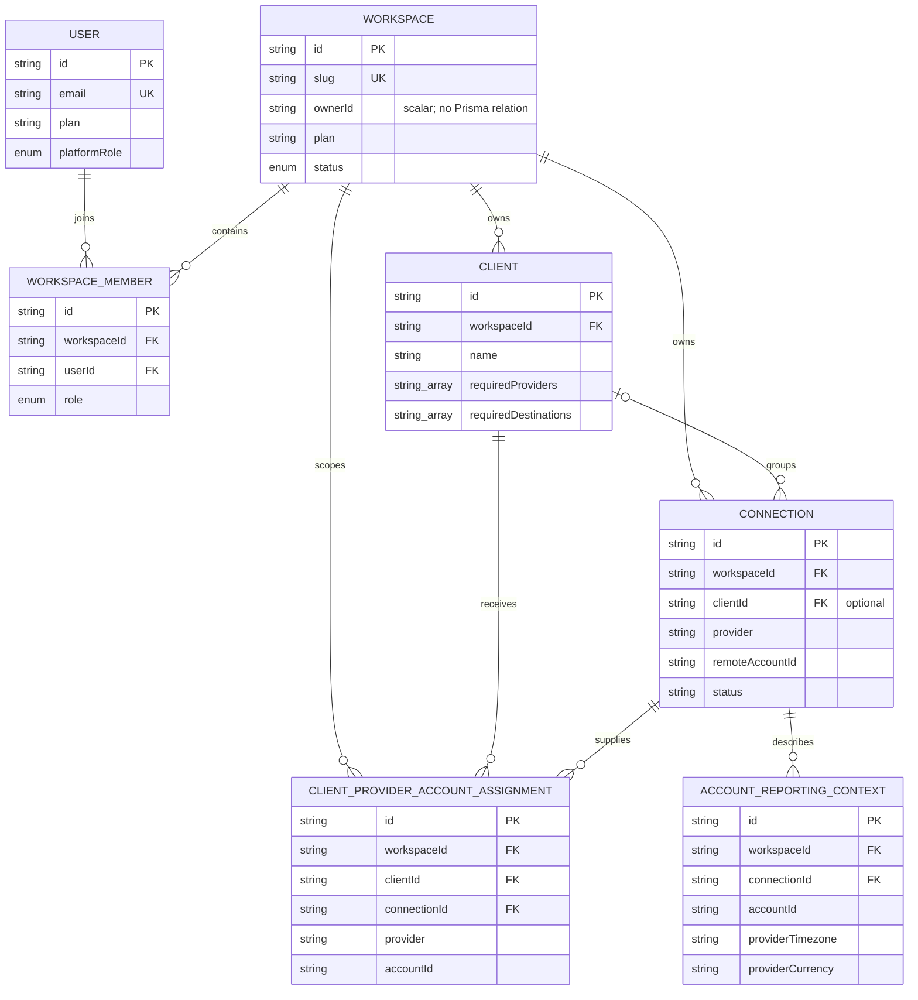
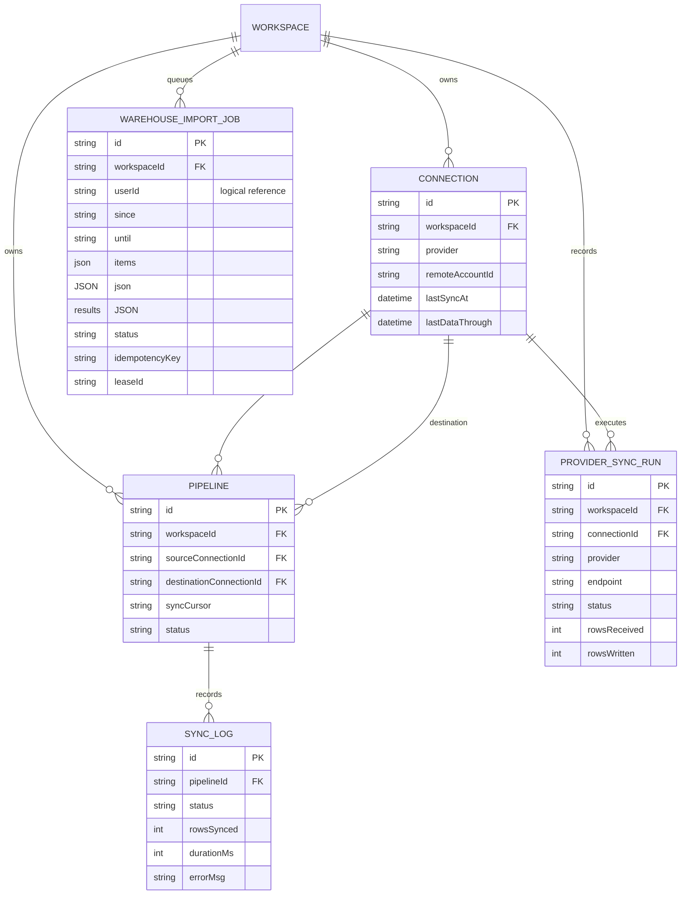
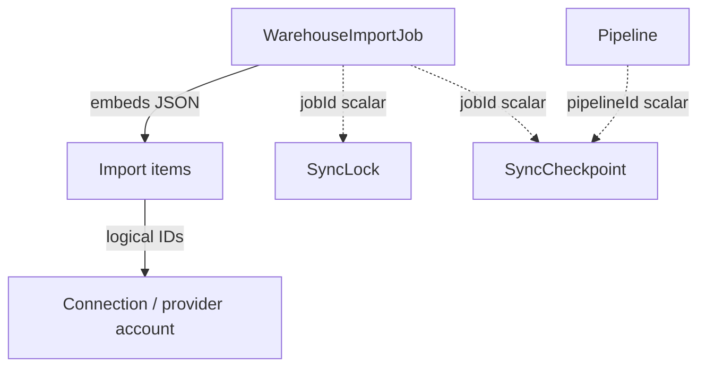
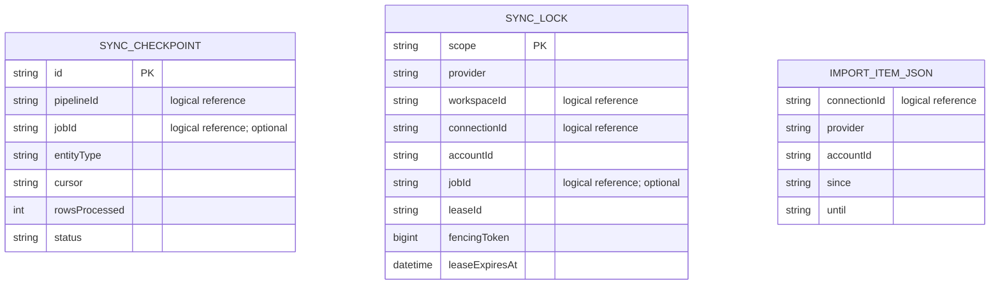
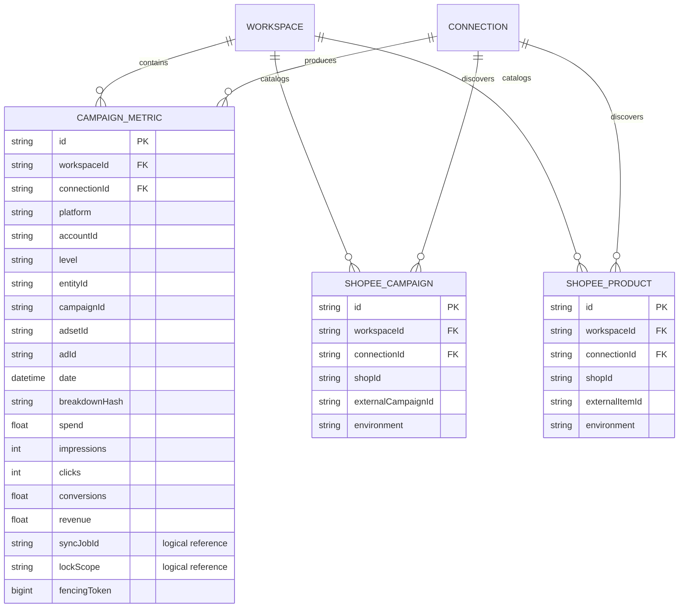
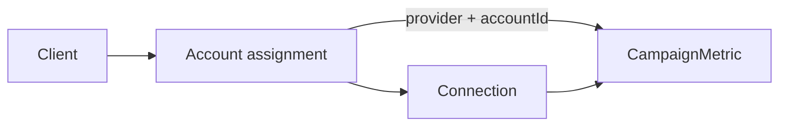
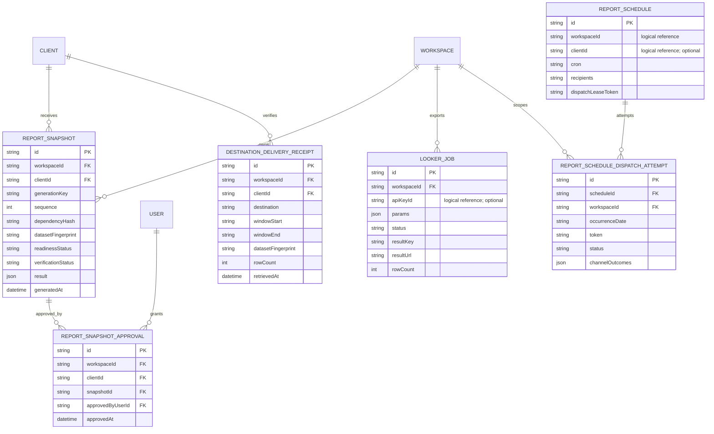
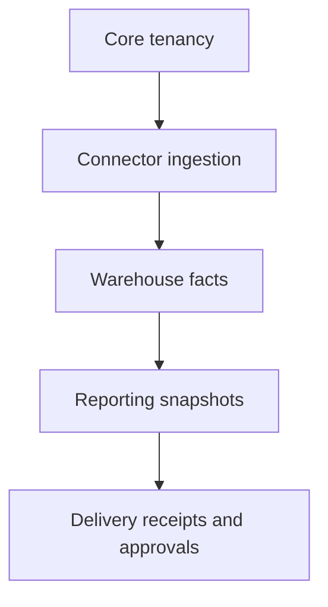

# Monstera Cloud Database ERD

**Source:** [`huynhtai22/monstera-cloud`](https://github.com/huynhtai22/monstera-cloud)  
**Schema inspected:** `prisma/schema.prisma` on the repository default branch  
**Schema blob:** `1f9908895a1dcbe3b26b1fe2cf4ff098fd98cfee`

This document presents four focused entity-relationship diagrams for Monstera Cloud. Solid relationships in the ERDs correspond to relations declared in the Prisma schema. Logical references stored in JSON or scalar columns are documented separately and are not represented as database-enforced foreign keys.

## Legend

| Marker | Meaning |
|---|---|
| `PK` | Primary key |
| `FK` | Declared foreign key |
| `UK` | Unique key or part of a unique constraint |
| `JSON` | Embedded JSON rather than a relational child table |
| `logical reference` | Identifier stored without a declared foreign key |
| `||--o{` | One-to-many |
| `o|--o{` | Optional one-to-many |

## 1. Core tenancy



### Core tenancy constraints

| Model | Important constraint |
|---|---|
| `WorkspaceMember` | One membership per `(workspaceId, userId)` |
| `Client` | Composite identity `(workspaceId, id)` supports tenant-safe foreign keys |
| `Connection` | Unique `(workspaceId, provider, remoteAccountId)` prevents duplicate roots inside a workspace |
| `ClientProviderAccountAssignment` | Unique `(workspaceId, provider, accountId)` gives each discovered provider account one authoritative client owner |
| `AccountReportingContext` | Unique `(workspaceId, connectionId, accountId)` |

### Core tenancy observations

- `Workspace.ownerId` is a scalar value; the Prisma schema does not declare a relation from `Workspace` to `User` for ownership.
- Account assignment is explicitly tenant-scoped with composite foreign keys to `Client` and `Connection`.
- `Connection.clientId` is optional, allowing workspace-level connections that have not been grouped under a client.

## 2. Connector ingestion

### Physical relationships



### Embedded and logical execution state





### Ingestion observations

- Import items are not a table. They are serialized inside `WarehouseImportJob.items`, so the database cannot enforce an item-to-connection foreign key.
- `WarehouseImportJob` has a workspace relation and a unique `(workspaceId, idempotencyKey)` constraint.
- `SyncCheckpoint.pipelineId`, `SyncCheckpoint.jobId`, and every ownership identifier in `SyncLock` are scalar references without declared Prisma relations.
- `SyncLock.fencingToken` provides stale-writer protection, while the lease and heartbeat fields provide worker ownership and recovery.
- The current checkpoint model is pipeline-oriented; using it for resumable historical-import chunks requires an explicit ownership design rather than assuming a relational link already exists.

## 3. Warehouse facts

### Physical fact and catalog relationships



### Client-to-fact query path



The `ClientProviderAccountAssignment` to `CampaignMetric` link is a query-time logical match on workspace, provider and account ID. It is not a declared foreign key.

### Fact identity and idempotency

The canonical uniqueness constraint for performance facts is:

```text
(connectionId, accountId, level, entityId, date, breakdownHash)
```

This means one normalized row exists for each connection, provider account, entity grain, entity, day and breakdown set. Campaign, ad-set and ad identities are stored as columns on `CampaignMetric`; there are no general relational `Campaign`, `AdSet`, or `Ad` tables in the current schema.

Additional indexes support these common scopes:

- `(workspaceId, platform, date)`
- `(connectionId, date)`
- `(workspaceId, accountId, date)`
- `(workspaceId, platform, accountId, date)`

Shopee catalogs use separate idempotency constraints:

- Campaign: `(connectionId, environment, shopId, externalCampaignId)`
- Product: `(connectionId, environment, shopId, externalItemId)`

## 4. Reporting and delivery



### Reporting and delivery constraints

| Model | Important constraint |
|---|---|
| `ReportSnapshot` | Unique `(generationKey, sequence)` and `(generationKey, dependencyHash)` make generation reproducible and idempotent |
| `ReportSnapshot` | Composite `(workspaceId, clientId)` relation prevents a snapshot from pointing to a client in another workspace |
| `ReportSnapshotApproval` | Unique `(workspaceId, snapshotId)` permits one durable approval per exact snapshot |
| `DestinationDeliveryReceipt` | Composite client relation proves the client belongs to the same workspace |
| `ReportScheduleDispatchAttempt` | Unique `(scheduleId, occurrenceDate)` prevents duplicate dispatch for one scheduled occurrence |

### Reporting observations

- The current database does not contain a generic `Report` table. `ReportSnapshot` is the immutable, reproducible report artifact.
- Export persistence is represented by `LookerJob`; other direct file exports may be generated without a database entity.
- Destination proof is stored separately in `DestinationDeliveryReceipt` and is also projected into snapshots as JSON evidence.
- Approval references an exact immutable snapshot, so a newer snapshot does not silently inherit an older approval.
- `ReportSchedule.workspaceId` and `clientId` are scalar identifiers without declared relations. The dispatch-attempt table does have declared relations to its schedule and workspace.

## Cross-domain overview



The principal ownership path is:

```text
User -> Workspace membership -> Workspace -> Connection
Connection -> Warehouse import/sync -> CampaignMetric
Client + account assignment -> selected CampaignMetric rows
Selected metrics -> ReportSnapshot -> Delivery receipt / Approval
```

## Recommended follow-up design review

Before implementing resumable two-year Meta/Google backfills, decide whether to introduce a relational import-item/chunk table. The present JSON design is durable at the job level but cannot enforce these relationships in PostgreSQL:

- chunk to job;
- chunk to connection;
- chunk to provider account;
- checkpoint to chunk;
- lock to job/chunk;
- per-chunk retry and idempotency.

A target design should preserve `WarehouseImportJob` as the parent job while giving each executable date slice its own relational identity, status, checkpoint, retry state and uniqueness constraint.

## Scope note

This ERD documents the current Prisma schema, not every logical object used in TypeScript. JSON payload types, transient API responses and computed reporting datasets are included only where they materially affect the database design.
