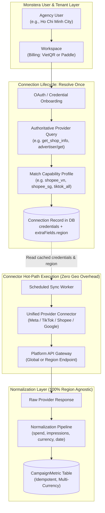

# Connector Region Policy & Multi-Region Expansion Architecture

**Scope:** Architectural standard and regional policy for Monstera Cloud connectors.  
**Core Stance:** **CURRENT PRODUCT FIRST. FUTURE REGION SUPPORT READY WHEN NEEDED.**  
**Status:** Active standard (Vietnam pilot priority; Southeast Asia multi-region ready).

---

## 1. Executive Summary & Philosophy

Monstera Cloud is an ETL and reporting platform that integrates advertising and e-commerce platforms, normalizes performance data into a unified schema, and delivers it to analytics and visualization destinations (Google Sheets, Looker Studio, BI tools).

Our immediate commercial and technical focus is pilot customers in **Vietnam**. Our current Vietnam connectors and sync workflows are fully operational. While we anticipate expanding to Southeast Asian markets (Singapore, Malaysia, Thailand, Philippines, Indonesia) and beyond, we will **not** build speculative multi-region runtime frameworks that jeopardize the simplicity, reliability, or speed of current operations.

### Foundational Principles

1. **Current Product First:** No hot-path sync flow, OAuth lifecycle, normalization pipeline, or production connector may be altered or burdened with latency for hypothetical future markets.
2. **Geography Belongs to the Connected Account:** Account geography is an attribute of the third-party platform entity (e.g., Shopee shop country, TikTok advertiser country, Google Ads customer timezone/currency), **never** the Monstera user's browser location, workspace origin, or server IP address. An agency user in Ho Chi Minh City can manage a Singaporean TikTok account and a Vietnamese Shopee shop within the same workspace.
3. **Resolve Once, Store the Result, Revalidate Occasionally:** Determining an account's region, currency, or API gateway must occur once during connection authorization (OAuth/onboarding) and be persisted in connection metadata. **Zero external geo/region resolution calls are permitted during hourly or daily sync runs.**
4. **Unified Connectors with Capability Profiles:** Do not create duplicate connector classes per country (e.g., do *not* write `TikTokVietnamConnector` vs. `TikTokSingaporeConnector`). Maintain a single provider connector that is parameterized by account-level capability profiles.
5. **Universal, Region-Agnostic Normalization:** The downstream warehouse schema (`CampaignMetric`, `RetailOrder`) remains strictly region-agnostic. Fields like `spend`, `impressions`, `clicks`, `revenue`, and `currency` accept multi-currency values without hardcoded local assumptions or lossy on-the-fly currency conversions.

---

## 2. Regional Distinction: Account Country vs. API Region

To avoid cross-border architectural confusion, Monstera Cloud enforces a strict separation between three concepts:

| Dimension | Definition | Determination Mechanism | Example |
|---|---|---|---|
| **Account Country / Market** | The legal or commercial jurisdiction of the advertiser account or merchant storefront. Determines tax policies, native currency, and feature availability. | Authoritative provider API response during onboarding (e.g., `shopInfo.region`, `advertiser.country`). Persisted in `Connection.credentials` / `extraFields`. | `VN` (Vietnam), `SG` (Singapore), `MY` (Malaysia) |
| **API Region / Gateway** | The network endpoint or cluster used by the third-party platform to serve developer API requests. | Connector routing table based on account market, or global entrypoint. | `https://api.lazada.sg/rest` (SEA gateway), `https://business-api.tiktok.com` (Global) |
| **Monstera Workspace Origin** | The administrative billing location or headquarters of the Monstera tenant. Governs subscription billing (e.g., VietQR vs. Paddle), **not** connector data pipelines. | Workspace owner settings / billing profile. | Agency located in Vietnam managing regional multi-country portfolios. |

---

## 3. Current Connector Status & Vietnam Policy

| Provider | Endpoint Model | Regional Policy Today | Future Readiness | Action Required Today |
|---|---|---|---|---|
| **Meta Ads** | Global Graph API (`graph.facebook.com/v23.0`) | Region-agnostic. Accounts dynamically discover currency and timezone from Meta Graph API. | 100% SEA Ready. Supports accounts worldwide with zero code adjustments. | **None.** |
| **Google Ads** | Global API (`googleads.googleapis.com/v16`) | Region-agnostic. Account discovery queries customer metadata; currency and timezones are dynamic per CID. | 100% SEA Ready. Works across any Google Ads MCC or customer account globally. | **None.** |
| **TikTok Business** | Global Open API (`business-api.tiktok.com/open_api/v1.3`) | Region-agnostic. Advertiser metadata provides native currency and timezone. Task polling and reporting endpoints are global. | 100% SEA Ready. Authoritative advertiser IDs and currencies dynamically mapped. | **None.** |
| **Shopee Open Platform** | Regionalized Open Platform (`partner.shopeemobile.com`) | **Vietnam-restricted capability gate:** `src/lib/provider-market-policy.ts` enforces `shopInfo.region === 'VN'` for Ads and reporting. | High. Authoritative region is queried once at OAuth (`GET /api/v2/shop/get_shop_info`) and stored in `extraFields.region`. Multi-region enablement requires only configuration list expansion. | **None.** Current policy is already clean, isolated, and tested. |
| **Lazada** | Regional Lazop Gateway (`api.lazada.sg/rest`) | Deferred for pilot. Country returned in token exchange (`tokenData.country`) and stored in credentials. | High. Token exchange stores country. Future activation requires routing through appropriate Lazop endpoints. | **Deferred.** |
| **TikTok Shop** | Regional/Global Services (`open-api.tiktokshop.com`) | Deferred for pilot. Auth and tokens store seller info. | High. Uses unified OpenAPI v2. | **Deferred.** |

---

## 4. Normalization Layer Regional Invariance

The core ETL and normalization contracts (`src/etl/extractors/campaignMetrics.ts`, `src/lib/sync-connection.ts`, and `prisma/schema.prisma`) are designed to be universally region-agnostic:

- **Metric Independence:** Core metrics (`impressions`, `clicks`, `spend`, `reach`, `cpc`, `ctr`, `conversions`, `revenue`, `roas`) are numerical and unit-independent.
- **Explicit Currency Stamping:** Every row in `CampaignMetric` carries an ISO currency string (e.g., `VND`, `SGD`, `MYR`, `USD`). 
- **No In-Database Cross-Border FX Conversions:** Extraction pipelines do not perform arbitrary FX conversion to a single base currency on write. Downstream consumers (BI dashboards, Google Sheets Add-on) handle multi-currency presentation using Monstera's currency-safe aggregation primitives (`src/lib/currency-safe-aggregation.ts`).
- **Dates & Timezones:** Dates are normalized to ISO dates (`YYYY-MM-DD`) anchored to the ad account's configured reporting timezone, avoiding split-day reporting drift.

---

## 5. Future Architecture: Capability Profiles

When regional expansion begins, Monstera Cloud will introduce **Capability Profiles** to parameterize single connector instances without duplicating connector code.



### Capability Profile Structure (Blueprint)

```typescript
// FUTURE ARCHITECTURE CONCEPT (Deferred until multi-region rollout)
export interface ProviderCapabilityProfile {
  provider: string;                    // e.g. "shopee", "tiktok_business"
  region: string;                      // e.g. "VN", "SG", "MY"
  apiBaseUrl: string;                  // Regional endpoint if applicable
  supportedCapabilities: string[];     // ["ads_reporting", "keyword_settings", "live_stream"]
  defaultCurrencyFallback?: string;   // Fallback currency if upstream omits it in response
}
```

### Key Rules for Capability Resolution:
1. **Onboarding / Re-Auth:** Validate the authoritative account region against the provider's capability registry. Reject unauthorized or unsupported regions with clean, human-readable error messages.
2. **Persistence:** Save the authoritative region and currency code in `Connection.extraFields` or `Connection.credentials`.
3. **Hot Path Sync:** Use the stored region directly. Never dispatch upstream `getShopInfo` or geo-lookup queries on recurring sync jobs.
4. **Revalidation:** Revalidate account region and eligibility only when:
   - The user triggers a manual reconnect or OAuth re-authorization.
   - The connector encounters a fatal credential invalidation error requiring token refresh.

---

## 6. Migration Protocol: Adding a New Market (e.g., Singapore)

When Monstera Cloud enters a new SEA market, the migration process follows this disciplined checklist:

1. **Policy & Capability Registration:**
   - Update `src/lib/provider-market-policy.ts` to add the new country code (e.g., `shopee: { ads_reporting: ["VN", "SG"] }`).
   - If upstream omits currency on performance rows (as observed in certain Shopee endpoints), update the mapper fallback from a hardcoded `"VND"` default to look up the connection's stored `extraFields.region` (e.g., `region === "SG" ? "SGD" : "VND"`).
2. **Sandbox / Pilot Upstream Verification:**
   - Onboard a test or pilot account registered in the target country.
   - Confirm OAuth exchange retrieves and stores the correct country/currency without errors.
3. **Endpoint Validation:**
   - Confirm whether the platform requires dedicated regional endpoints (e.g., Lazada Lazop regional gateways) or routes via global endpoints (e.g., TikTok, Meta, Google).
4. **End-to-End Sync Test:**
   - Execute an extraction cycle into `CampaignMetric`.
   - Verify that amounts, fractional digits, currencies (`SGD`), and date boundaries conform to downstream warehouse guarantees.
5. **No Database Migration Required:**
   - Because `Connection.credentials` uses flexible JSON and `CampaignMetric` stores `currency` dynamically, zero breaking database schema migrations are necessary to add new regions.

---

## 7. Explicit Non-Goals & Deferrals

The following items are **explicitly deferred** and must **not** be implemented during the Vietnam pilot phase:

- **NO Dynamic IP Geo-Resolution:** Never inspect client or server IP addresses to determine connector behavior.
- **NO Connector Class Duplication:** Never create separate connector classes per country.
- **NO Database Schema Migrations:** Do not add speculative `region` columns to core tables when `credentials.extraFields` already stores this data safely.
- **NO Automated FX Conversions on Ingestion:** Do not convert foreign currency spend into USD or VND during sync; preserve the original transactional currency.
- **NO Multi-Region Worker Queues:** Keep sync job dispatching centralized and simple until scale demands regional worker pools.
